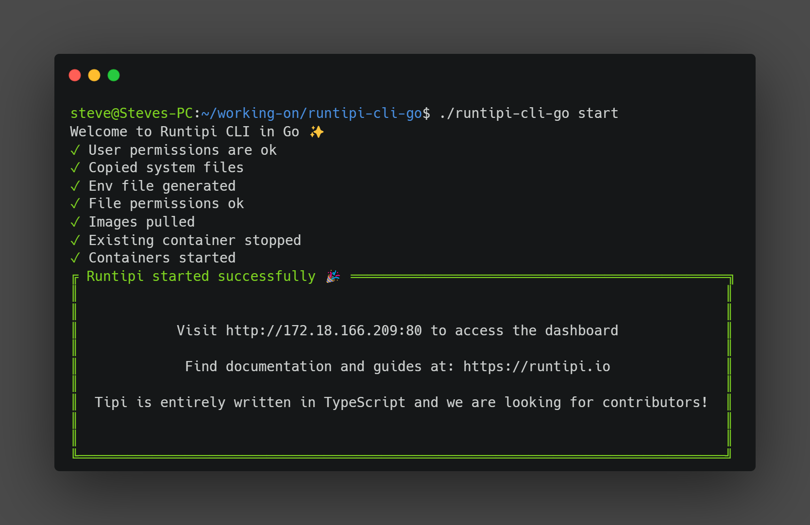

## Runtipi CLI GO

> Warning ⚠️: This is now under the runtipi organization and it will be maintained by the whole runtipi team.

A reimplementation of the [Runtipi CLI](https://github.com/runtipi/cli) in the GO programming language
with some imporevements and new features.



> Warning ⚠️: This is in early stages of development, I am trying to make this better than the official CLI and maybe just maybe make Nicolas use this versison

### Why?

Why am I building this? Two reasons, firstly I don't like rust and I think its a bad choice for the CLI so I want to build
something better. Secondly, I just want to learn GO.

## Features

The Runtipi GO CLI has all the official Runtipi CLI features and the following extra ones:

- List app backups command (`./runtipi-cli app list-backups`)
- Healthcheck command using the worker API
- System readings from the worker API
- Backup command\*
- List backups command (for runtipi)
- Neofetch command (easter egg)
- Automatic backup of the CLI before update

\*I will not add a restore command due to the complexity of explaining users how to use it

### Installation

To install the CLI you need to follow 4 simple steps.

1. Download the latest version matching your system's arch from the [releases](https://github.com/steveiliop56/runtipi-cli-go/releases/) page.
2. Put the CLI in your `runtipi` folder and rename it to `runtipi-cli-go`.
3. Make it executable `chmod +x runtipi-cli-go`
4. Start using it `sudo ./runtipi-cli-go start`

### Building

To build the CLI you need to have go installed and then run these commands:

Firstly clone the repository:

```bash
git clone https://github.com/steveiliop56/runtipi-cli-go
cd runtipi-cli-go/
```

Install packages:

```bash
go get .
```

Build:

```bash
go build
```

You should have the CLI named `runtipi-cli-go`.

### License

The license is the same as the official Runtipi CLI, so the project is licensed under the GNU General Public License v3.0. TL;DR — You may copy, distribute and modify the software as long as you track changes/dates in source files. Any modifications to or software including (via compiler) GPL-licensed code must also be made available under the GPL along with build & install instructions.

### Contributing

If you like you can contribute to this project by creating a pull request. Any help is appreciated.

### Acknowledgements

Thank's a lot to:

- [Runtipi CLI](https://github.com/runtipi/cli) because this code is msotly a translation right now
- [Carbon](https://carbon.sh) for the cool CLI screenshot
- [Nicolas](https://github.com/meienberger) because well...he made Runtipi.
